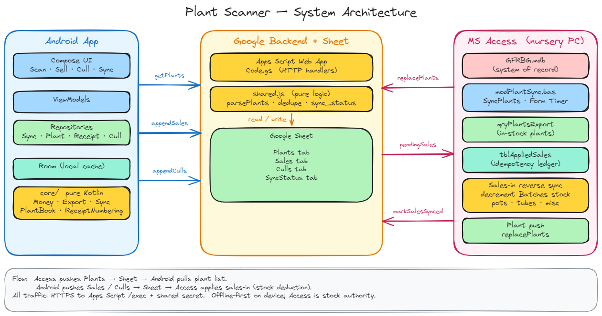

# Plant Nursery Scanner

An offline-first Android app for the Royal Botanic Gardens Melbourne volunteer nursery: scan a plant
barcode, build a receipt, save it locally, and auto-export sales to Google Sheets. Built for elderly
volunteers (big buttons, big text, high contrast, no flicker, tap-not-gesture).

> Status: **Phase 1 complete** (Sell · Sync plant list · Export sales). Phase 2 (accession, label,
> repot, death) is sketched in the spec but not built.

## What it does

- **Sell** — scan Code 128 (or type the accession), auto-fill the plant, key pots/price/discount %,
  add to a receipt, finish & save. Works **fully offline**. Not-found scans are sold "as unknown" and
  kept for later reconciliation — never lost.
- **Cloud sync** — every ~1 minute when online (and on History/Plants ↻): export pending sales/culls,
  then import the plant list. Silent on the ticker; Done/Error on manual ↻.
- **Receipts** — local sales history, grouped by receipt.
- Receipt numbers are `PP-<epochSeconds>-<seq>` (e.g. `07-1718000000-1`): a per-device 2-digit prefix
  `PP`, the creation time in epoch seconds, and a sequence that resets daily — so multiple devices
  never collide and numbers survive a reinstall.

## Architecture



### Repo modules (independently buildable)

```
core/      Pure Kotlin/JVM — ALL business logic (money, receipt #, plant lookup, sync, export, config).
           No Android types. Unit-tested with `gradle test`.
app/       Android (Jetpack Compose + Room + CameraX + ML Kit + OkHttp + DataStore). Thin glue over
           `core`. Consumes core via a Gradle composite build.
backend/   Google Apps Script web app (getPlants / appendSales / appendCulls, shared-secret auth,
           dedupe). Pure logic mirrored as Node-testable JS in `shared.js`. VBA sync module lives in
           `backend/access/modPlantSync.bas` (deployed to the nursery PC — see docs/deploy/access.md).
```

Why the split: the build machine had no Android SDK, so every decision that's easy to get wrong was
pushed into `core/` and tested there; the Android module is declarative UI compiled with the SDK.

## Build & test

```bash
# Business logic (no Android SDK needed)
cd core && gradle test

# Backend logic (Node)
node --test backend/test/logic.test.js

# Android app (needs Android Studio / Android SDK + JDK 17). Two flavors: prod and qa ("test").
./gradlew :app:assembleProdDebug  # -> app/build/outputs/apk/prod/debug/app-prod-debug.apk
./gradlew :app:assembleProdRelease :app:assembleQaRelease   # installable prod + test packages
```

## Deploy

See **[docs/deploy/README.md](docs/deploy/README.md)** — backend → Android → connect → Access, in that order.

## Key tech choices

- **Kotlin + Jetpack Compose** — native, since the target is Android-only and sideloaded.
- **ML Kit Barcode Scanning** (bundled, offline), restricted to **Code 128**.
- **Room** for offline-first storage; the receipt `status` column *is* the sync queue.
- **In-app coroutine ticker** for the 1-minute auto-export (WorkManager's floor is 15 min).
- **Apps Script + shared secret** instead of the Sheets API + OAuth.

See `docs/tech-stack.md` for the full rationale and `docs/superpowers/specs/` for the design spec.

## Project docs

- [`docs/architecture.png`](docs/architecture.png) — system architecture diagram (source:
  [`docs/plant-scanner-architecture.excalidraw`](docs/plant-scanner-architecture.excalidraw)).
- `docs/superpowers/specs/2026-06-09-plant-scanner-screen-flows-design.md` — the approved design spec.
- `docs/tech-stack.md` — technology decisions.
- `docs/superpowers/plans/2026-06-09-plant-scanner-implementation.md` — the implementation plan.
- `docs/deploy/` — deployment & wiring instructions (backend → Android → connect → Access).
